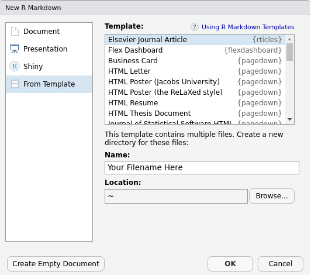
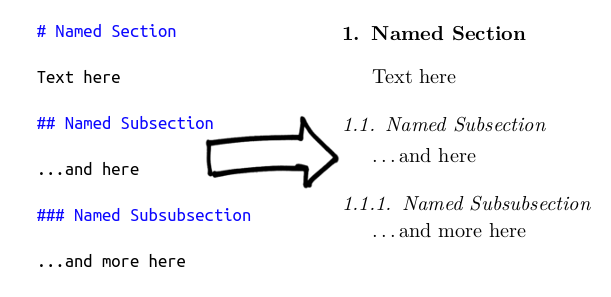
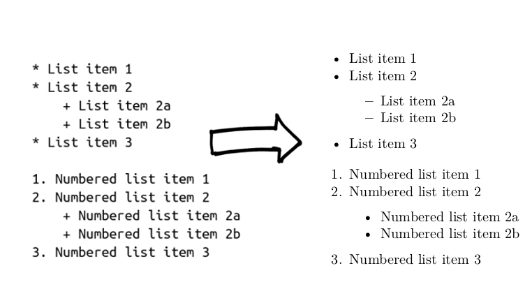

```{r setup, include=FALSE}
knitr::opts_chunk$set(echo = FALSE, warning = FALSE, message = FALSE, fig.path = "")
knitr::opts_chunk$set(fig.pos = "H", out.extra = "")
knitr::opts_chunk$set(tidy.opts = list(width.cutoff = 60), tidy = TRUE)
```

```{r renv, eval=FALSE}
# this code was executed to create the renv snapshot and the renv.lock lockfile
renv::init()
renv::snapshot()
# this line should be executed with an R project to obtain the historical R libraries used to build the project.
renv::init()
renv::restore()
```

# Introduction

There is increasing attention paid to the concept of reproducible research in the biological and medical sciences @munafo2017manifesto. The problem of poor reproducibility of biomedical research has been attributed to a number of factors: study design, preanalytical handling, reagent lot variation, suboptimal analytical reproducibility, researcher bias, incorrect use of statistical methodologies, and unexpected artifacts of software--even when working-as-designed.

Reproducibility in research has different components, which have been previously defined as i) methods reproducibility: protocols, measurement procedures, reagents, data processing and analysis ii) results reproducibility: the ability for an independent study to obtain similar results in similar experimental conditions, iii) inferential reproducibility: the ability of another researcher to draw the same conclusions from the original data or a similar data set @goodman2016does.

One aspect of research reproducibility is statistical transparency, which primarily falls into the category of methods reproducibility, but encompasses some aspects of results and inferential reproducibility. A concrete way to address statistical transparency is the so-called "executable document" or "literate programming" @knuth_literate_1992. These terms refer to a document that is itself a script or program that directly pulls in the raw data for the study and reveals the entire statistical methodology in the code. When the program or code is executed, it produces a human readable document to which we are accustomed (e.g. PDF, Microsoft (MS) Word or HTML) complete with statistics and figures. The use of reproducible research tools has become more common because of the large and complex data sets on which modern clinical research is performed and in response to conspicuous examples of serious inferential error, which would have been more easily detected (or perhaps avoided entirely) were the research performed reproducibly to begin with [@baggerly2004reproducibility; @Baggerly2009].

While there are a number of approaches to reproducible document preparation [@leisch2002sweave; @poore2013reproducible; @kluyver2016jupyter] perhaps the most mature of these is the use of the R **knitr** package @xie2018knitr and RMarkdown document format @allaire2021 inside of the RStudio open-source development environment for the R programming language.

In this article, we will review all aspects of reproducible manuscript preparation for JMSACL using the R programming language and the **rmarkdown** and **knitr** packages to generate all calculated/rendered aspects of a manuscript, including headers, sections, figures, tables, captions, inline numerical results (including p-values and confidence intervals), references, and reference formatting. The result is LaTeX source code that can be submitted and/or compiled to pdf. LaTeX (stylized as \LaTeX) is a versatile and powerful type setting system used for publishing @latex_link.

# Set Up

## Necessary Software Installation

The reader will need to install the R programming language on their computer, which is available for MacOS, Linux and Windows operating systems @Rdownload. Additionally, in order to generate LaTeX code from which pdf files can be generated, it will be necessary to install the LaTeX markup language, which can be installed in a dedicated manner @latex_link or more simply by installing the R **tinytex** package @xie2019. The reader should also install the RStudio integrated development (IDE) environment @Rstudio. In order to generate LaTeX results immediately compatible with submissions to Elsevier journals, the **rticles** @rticles package is also required.

## Creating a New Manuscript Template

Once the necessary software is installed, from a new session in RStudio, select File \> New File \> RMarkdown from the menu and then when a window appears, select From Template and Elsevier Journal Article as shown in figure 1. After entering the desired filename and a directory into which you wish to save your manuscript, click OK and the RMarkdown file template will appear. This template can be modified as required and will compile when the "Knit" button is selected, generating a PDF and the LaTeX source code, which can be submitted to JMSACL.

```{r fig1, out.width = '60%', fig.cap = 'RStudio selection window for Elsevier Journal Article', fig.align = 'center'}
library(png)

```

# Proceeding with Writing

## Title Page and Front Matter

The LaTeX frontmatter of the article is generated by a YAML header at the top of the document (YAML is a recursive acronym for "YAML Ain't Markup Language" and serves as a human-readable configuration language.) The content is contained between two sets of three dashes (- - -), and being human-readable is fairly self-explanatory to modify. It should be noted that it is \emph{very} sensitive to indentation and spacing (unlike the R language) and care must be taken not to modify either.

## Markdown Basics

### Sections and Subsections

For sections of prose, RMarkdown uses the formatting of the Markdown markup language, a complete review of which is not necessary as it is extensively discussed elsewhere @rmarkdowndefinitive (web resources and how-to tips and syntax also are readily available, e.g. <https://rmarkdown.rstudio.com>). A named section of the document is created with a `#` followed by the section title, subsections are made with `##` and subsubsections with `###`. The code and corresponding document output is shown in figure 2. It should be noted that carriage returns shown in the Markdown code are required after the section name in order to generate the desired output.

### Italicization and Bolding

Italicization of text is created by surrounding the text of interest with single asterisks so that `*text written like this*` will create output as *text written like this*. Corresponding use of double-asterisks will create bolded text so that `**text written like this**` will create this bolded output: **text written like this**.

```{r fig2, out.width = '75%', fig.cap = 'How to define sections and subsections', fig.align = 'center'}

```

A benefit of writing in plain text where everything is explicitly encoded is that the author avoids the frustrations of hidden word processor decisions about automatic correction, formatting of text, bullets, and page breaks.  

### Bullets and Numbered Lists

Bulleted lists are created with each item on a new line preceded by an `*`, while numbered lists are likewise created by a series of new lines preceded by the corresponding number of the list. Indented sublists are accomplished with indentation and the use of a `+`.

```{r fig3, out.width = '90%', fig.cap = 'Bulleted and numbered lists', fig.align = 'center'}

```

### Mathematics

RMarkdown allows the incorporation of beautifully rendered mathematics using the syntax of LaTeX. Mathematics can be typeset inline by surrounding the mathematical expression with dollar signs so that `$\Delta G = \Delta G^{\circ} + RT \ln{Q}$` will be rendered $\Delta G = \Delta G^{\circ} + RT \ln{Q}$. If mathematics is surrounded by `$$` on each side, it will be typeset as a formula centered on a new line so that `$$\frac{d^2y}{dx^2} + (a-2q\cos2x)y = 0$$` is rendered:

$$\frac{d^2y}{dx^2} + (a-2q\cos2x)y = 0$$

## R Code

The power of RMarkdown from the perspective of reproducible research is the ability to embed R code chunks into the document so that the statistical methodology is entirely exposed in the .Rmd file. The readable output can be selected to show both the code and the output of the code thereby making the entire analytical process illustrative, readable, and reproducible. Sections of code are created by the use of code chunk delimiters ```` ```{r} ```` and ```` ``` ```` like so:

    ```{r}`r ''`
    # generate 1000 random numbers: mean = 0 and sd = 1
    z <- rnorm(1000,0,1)
    # create a quick summary of the distribution
    summary(z)
    ```

The text appearing after the # signs are explanatory comments that are ignored by the R engine. The code above results in direct output from the R console into the document:

```{r example1, eval = TRUE}
# make the random numbers the same for each run by setting seed
set.seed(100) 
# generate 1000 random numbers: mean = 0 and sd = 1
z <- rnorm(1000,0,1)
# create a quick summary of the distribution
summary(z) 
```

Generally, it is undesirable to have R console (the code interface of R) output print directly into a manuscript, as shown above. For this reason, all direct output of R's output, warnings, messages can all be controlled with so-called chunk options. These options can be set globally for the entire document or on a chunk-by-chunk basis, as required. For academic manuscripts, the following chunk option settings suit most contexts:

    ```{r, echo = FALSE, warning = FALSE, message = FALSE}`r ''`
    # Chunk code here
    ```

The above options suppress the R code in the document (`echo = FALSE`), all R warnings (`warning = FALSE`), and messages (`message = FALSE`), but permits variables to be assigned and tables/figures to be generated. The following code can be used to set these variables globally and by setting `fig.path = ""`, conveniently force figures to be output to the same folder as the .Rmd file.

    ```{r, include = FALSE}`r ''`
    knitr::opts_chunk$set(echo = FALSE, warning = FALSE, message = FALSE, fig.path = "")
    ```

\noindent The parameter `include=FALSE` permits code to run, but suppresses all console and graphical output.

All code chunk calculations are performed at the time of document knitting by the R language interpreter and if the raw data input data are updated, re-knitting will propagate all changes throughout the document--including all figures, tables and inline text calculated from R code. For an analysis with a large dataset, the re-rendering can take time (picture re-running the entire analysis and figure rendering just to change a typo), but can be managed by using 'caches'. Caches save parts of the analysis and are analogous to saving parts of webpages, enabling them to load faster. Parts that don't change aren't re-rendered. Like all things in R, caching of a chunk is optional and controlled as follows:

    ```{r, cache = TRUE}`r ''` 
    # Computationally expensive code here
    ```

It is customary (though optional) to name code chunks for the purposes of quick identification and cross-referencing (through use of the bookdown package described elsewhere @rmarkdowndefinitive). Code chunk names must be unique and are defined in the code chunk delimiter:

    ```{r, chunk_name}`r ''` 
    # Chunk code here
    ```

### Tables

```{r tidylibs}
library(pROC) 
library(kableExtra)
library(dplyr)
library(tidyr)
library(stringr)
```

For the purposes of illustration we will use a biomedical dataset available in the **pROC** package taken from a 2010 study by Turck et al examining blood biomarkers in patients suffering subarachnoid hemmorhage @turck2010multiparameter. The dataset has 7 variables named: 1. gos6: the Glasgow Coma Outcome Score (1--6) 2. outcome: Clinical Outcome (Good/Poor) 3. gender (M/F) 4. age 5. wfns: The World Federation of Neurological Surgeons score (1--5) 6. s100b: S100 calcium-binding protein B concentration (s100b in $\mu$g/L) and 7. ndka: Nucleoside diphosphate kinase A concentration (nkda in $\mu$g/L).

While there are a number of ways to render a table into an RMarkdown document, to our mind the simplest means is to prepare a dataframe of results and to use the `kable()` function from the **knitr** package @xie2018knitr with the **kableExtra** package to permit many of the complex table structures available natively in LaTeX @2021kableextra. With these tools, a dataframe can be rendered as a table easily, as in the following example code chunk.

------------------------------------------------------------------------

    ```{r}`r ''`
    # call required libraries
    library(pROC) 
    library(kableExtra)
    library(dplyr)
    library(tidyr)
    library(stringr)
    
    # invoke the subarachnoid hemorrhage data set from the pROC package
    data(aSAH) 
    
    sah_frame <- aSAH %>%
      # group the cohort into Glasgow Coma Outcome Score 
      group_by(gos6) %>% 
      # produce summary statistics of age, s100b and NDKA
      summarise(
        median_age = median(age), 
        IQR_age = IQR(age),
        median_s100b = median(s100b),
        IQR_s100b = IQR(s100b),
        median_ndka = median(ndka),
        IQR_ndka = IQR(ndka)
      ) %>%
      # round all age columns to 1 decimal
      mutate(across(median_age:IQR_age,
                    ~ sprintf(., fmt = '%.1f'))) %>%
      # round all biomarker columns to 2 decimals
      mutate(across(median_s100b:IQR_ndka,
                    ~ sprintf(., fmt = '%.2f'))) %>%
      unite("Age", median_age:IQR_age, sep = " (") %>%
      mutate(Age = str_c(Age, ")")) %>%
      # bring biomarker results and their IQRs into one column
      unite("s100b", median_s100b:IQR_s100b, sep = " (") %>%
      mutate(s100b = str_c(s100b, ")")) %>%
      unite("ndka", median_ndka:IQR_ndka, sep = " (") %>%
      mutate(ndka = str_c(ndka, ")"))
    
    caption <-
      "Summary table from the aSAH data set.\\
      Results are presented as median (IQR)"
    
    # generate formatted output for table generation
    sah_frame %>%
      kable(
        booktabs = "TRUE",
        format = "latex",
        align = 'cccc',
        col.names  = c("GOS6", "Age(y)", "S100b(ug/L)", "NDKA(ug/L)"),
        caption = caption
      ) %>%
      kable_styling(latex_options = c("HOLD_position", 'striped'), stripe_color = "#E0FAFA")
    ```

\noindent The code chunk above first performs necessary calculations to prepare a summary dataframe (a small table called a 'tibble', more precisely) and then renders table 1. Note that the formatting of all of these outputs is infinitely customizable in terms of shading, row highlighting, border styles, fonts, decimal places, and captions.

```{r table1}
# call required libraries
library(pROC) 
library(kableExtra)
library(dplyr)
library(tidyr)
library(stringr)

# invoke the subarachnoid hemorrhage data set from the pROC package
data(aSAH) 

sah_frame <- aSAH %>%
  # group the cohort into Glasgow Coma Outcome Score 
  group_by(gos6) %>% 
  # produce summary statistics of age, s100b and NDKA
  summarise(
    median_age = median(age), 
    IQR_age = IQR(age),
    median_s100b = median(s100b),
    IQR_s100b = IQR(s100b),
    median_ndka = median(ndka),
    IQR_ndka = IQR(ndka)
  ) %>%
  # round all age columns to 1 decimal
  mutate(across(median_age:IQR_age,
                ~ sprintf(., fmt = '%.1f'))) %>%
  # round all biomarker columns to 2 decimals
  mutate(across(median_s100b:IQR_ndka,
                ~ sprintf(., fmt = '%.2f'))) %>%
  unite("Age", median_age:IQR_age, sep = " (") %>%
  mutate(Age = str_c(Age, ")")) %>%
  # bring biomarker results and their IQRs into one column
  unite("s100b", median_s100b:IQR_s100b, sep = " (") %>%
  mutate(s100b = str_c(s100b, ")")) %>%
  unite("ndka", median_ndka:IQR_ndka, sep = " (") %>%
  mutate(ndka = str_c(ndka, ")"))

caption <-
  "Summary table from the aSAH data set.\\
  Results are presented as median (IQR)"

# generate formatted output for table generation
sah_frame %>%
  kable(
    booktabs = "TRUE",
    format = "latex",
    align = 'cccc',
    col.names  = c("GOS6", "Age(y)", "S100b(ug/L)", "NDKA(ug/L)"),
    caption = caption
  ) %>%
  kable_styling(latex_options = c("HOLD_position", 'striped'), stripe_color = "#E0FAFA")
```

### Figures

Figures generated by code chunks are inserted by default into the text. Alternatively, they can be saved to a file in the image format required by the journal. The following code chunk renders and inserts figure 4. As an editorial side note for journal publishers, neither reviewers nor authors find any benefit in having tables and captions on separate pages grouped at the end of a manuscript.

------------------------------------------------------------------------

    ```{r, fig.width = 5, fig.height = 4}`r ''`
    library(ggplot2)
    library(cowplot)

    # prepare a boxplot of s100b grouped by the World Federation 
    # of Neurological Surgeons score
    p1 <- aSAH %>%
      group_by(wfns) %>%
      ggplot(aes(x = wfns, y = s100b, fill=wfns)) +
      geom_boxplot() + 
      scale_fill_brewer(palette = "BuPu")+
      theme(legend.position = "none")  +
      ylab(expression('S100b (' * mu * 'g/L)'))+
      xlab("WFNS Classification")
      
    # prepare a boxplot of NDKA grouped by the World Federation
    # of Neurological Surgeons score  
    p2 <- aSAH %>%
      group_by(ndka) %>%
      ggplot(aes(x = wfns, y = ndka,fill=wfns)) +
      ylim(c(0,100)) +
      geom_boxplot() +
      scale_fill_brewer(palette = "BuPu")+
      theme(legend.position = "none") +
      ylab(expression('NDKA (' * mu * 'g/L)'))+
      xlab("WFNS Classification")
    
    # output the two plots side-by-side  
    plot_grid(p1, p2, labels = "AUTO")
    ```

```{r fig4, fig.width = 5, fig.height = 4, fig.cap = "Boxplots of s100b and NDKA concentrations as a function of world federation of neurological surgeons classification of SAH."}
library(ggplot2)
library(cowplot)

# prepare a boxplot of s100b grouped by the World Federation of Neurological Surgeons score
p1 <- aSAH %>%
  group_by(wfns) %>%
  ggplot(aes(x = wfns, y = s100b, fill=wfns)) +
  geom_boxplot() +  
  scale_fill_brewer(palette = "BuPu")+
  theme(legend.position = "none")  +
  ylab(expression('S100b (' * mu * 'g/L)'))+
  xlab("WFNS Classification")

# prepare a boxplot of NDKA grouped by the World Federation of Neurological Surgeons score
p2 <- aSAH %>%
  group_by(ndka) %>%
  ggplot(aes(x = wfns, y = ndka, fill=wfns)) +
  ylim(c(0,100)) +
  geom_boxplot() +
  theme(legend.position = "none") + 
  scale_fill_brewer(palette = "BuPu")+
  ylab(expression('NDKA (' * mu * 'g/L)'))+
  xlab("WFNS Classification")

# output the two plots side-by-side
plot_grid(p1, p2)
```

### Inline calculations

It is frequently necessary to refer to results of a study within a sentence. Under these circumstances, R code can be embedded inline by delimiting the code as follows: `` `r knitr::inline_expr("code goes here")` ``. For example, this text:

\vspace{12pt}

\noindent The aSAH data set has `` `r knitr::inline_expr("nrow(aSAH)")` `` rows providing biomarker results for `` `r knitr::inline_expr("table(aSAH$gender)[1]")` `` males and `` `r knitr::inline_expr("table(aSAH$gender)[2]")` `` females who suffered subarachnoid hemorrhage. The mean S100b for all participants was `` `r knitr::inline_expr("round(mean(aSAH$s100b),2)")` `` `$\pm$` `` `r knitr::inline_expr("round(sd(aSAH$s100b),2)")` `` `$\mu$`g/L.

\vspace{12pt}

\noindent will result in this display which is calculated at compilation:

\vspace{12pt}

\noindent The aSAH data set has `r nrow(aSAH)` rows providing biomarker results for `r table(aSAH$gender)[1]` males and `r table(aSAH$gender)[2]` females who suffered subarachnoid hemorrhage. The mean S100b for all participants was `r round(mean(aSAH$s100b),2)` $\pm$ `r round(sd(aSAH$s100b),2)` $\mu$g/L. 

\vspace{12pt}

This direct link between data analysis and manuscript preparation is extremely powerful and likely to reduce errors by removing manual transcription steps.

## Reference Management

References are managed with LaTeX's reference management system, BibLaTeX. The BibLaTeX references must be stored in a .bib text file with entries in a prescribed syntax, which can be cut and paste from Google Scholar, from the URL of the article itself or exported from popular reference managers, such as EndNote, Zotero and Mendeley. Jabref is a notable cross-platform GUI reference manager dedicated to LaTeX. The structure of .bib file entries is self-explanatory with most entries appearing as follows:

    @Article{Herold2016,
      title = {Building a foundation for clinical mass spectrometry
      and improved patient standard-of-care},
      journal = {Clinical Mass Spectrometry},
      volume = {1},
      pages = {1},
      year = {2016},
      issn = {2376-9998},
      doi = {https://doi.org/10.1016/j.clinms.2016.10.001},
      url = {https://www.sciencedirect.com/science/article/pii/S2376999816300289},
      author = {David Herold and Chris Herold}
    }

To cite the entry above, one can simple write `@Herold2016` and the numbered reference will appear in line @Herold2016 and in the references section at the time of document knitting. Reference numbering updates automatically each time the document is knit.

Formatting of references is dictated by the citation style language (.csl) file referenced in the YAML header. The .csl file appropriate for the journal of interest can be downloaded from the Zotero Style Repository @Zoterostyles and placed in the same folder as the .Rmd file. In this case, the correct file is still referenced by the journal's prior name, Clinical Mass Spectrometry.

## For Submission

When an author is satisfied that their manuscript is ready for submission to JMSACL, they may knit the document one last time. This will generate a finalized LaTeX source file in the same folder as the .Rmd file having the same name but with a .tex file extension. The user should have set the global chunk option for figure locations to be local to the .Rmd by using `knitr::opts_chunk$set(fig.path = "")` as prescribed above. This will allow Elsevier's document management system to compile the LaTeX source code to PDF. Proceed with your submission process via the Elsevier Editorial Manager website submitting the .tex as your *manuscript* file and the figures as per usual. Additionally, your .bib file, and .csl file must each be submitted as a "LaTeX Source File".

# Discussion

We have outlined the process for preparing a manuscript reproducibly using RMarkdown and RStudio. This workflow is suitable for any Elsevier journal with only minor modifications from what we have shown in this example for JMSACL. Although many journals do not accept LaTeX as a submission format, it is fairly easy to use the **bookdown** package @xie2021bookdown and to select MS Word as the output format. As control of MS Word formatting is somewhat more challenging from RMarkdown, some manual intervention may be required after knitting depending on the author and journal preferences.

We would be remiss not to underscore that the RMarkdown workflow permits a fully transparent end-to-end data pipeline from the original data set to the finished manuscript---a process we were not obliged to undertake in this example, since we were not working from any primary uncleansed data source. However, all aspects of the data pipeline can be incorporated into R code chunks, producing visible output as desired: the pre-processing code (data cleansing), the analytical code (statistical analysis) and the presentation code (tables and figures) @peng2015report. 

It is also important to note that within R code chunks one is able to interact with databases (e.g., SQL or Apache Spark) on the fly using either native syntax or using R-code translated to SQL or Spark SQL by R packages written for this purpose [@DBI; @sparklyr]. One can also insert code from other languages, such as Python @Reticulate and Julia @JuliaCall as needed---for the convenience of not having to translate previously developed source or to improve performance. 

While a reader new to the concept of literate programming may not yet perceive the need, preparation of a manuscript in RMarkdown permits the use of a version-control system such as Git and a hosting system such as [github](https://github.com/). These systems allow change-tracking, collaboration and (when necessary) reversion to previous versions of the source code. By this means, not only the final product but all prior incarnations are available for review. In contrast, traditional GUI-based statistical and document preparation tools generally lack mechanisms to track revisions.  The RMarkdown source code for this manuscript can be downloaded at [github.com/drdanholmes/jmsacl_reproducible_research](https://github.com/drdanholmes/jmsacl_reproducible_research) @drdanholmesgithub.

Notwithstanding the transparency that the RMarkdown workflow affords, there still remains the problem that the R Language packages undergo very rapid development, especially those associated with the popular tidyverse suite @wickham2019. This means that documents that properly knit at present, may not knit in the future because of package or function modification and/or deprecation. However, solutions to this problem are well-developed and the reader is encouraged to explore the use of the renv and checkpoint packages. The **renv** package creates a local R library within an R project @renv. Any R processes launched within the project directory use the dedicated project library instead of the user's regular R library, thereby guaranteeing future behaviour of the code. Construction and reconstruction of local *renv* libraries is discussed in the appendix. The **checkpoint** and **packrat** packages address the same problem with different strategies [@ushley2021packrat; @devries2020checkpoint].

Both of these package-dependency solutions may still have compatibility problems, particularly as it pertains to the version of R itself. For this reason, a definitive solution may be a Docker container (or similar) [@boettiger2015introduction; @nust2019containerit; @chamberlain2014using] into which all necessary software is packaged in a minimalistic image consuming much less resources than a virtual machine. The research can then be shared as a Docker image without concern that any required software is missing or out of date. For illustrative purposes, we have containerized this manuscript and its dependencies using Docker. The Docker image is available at [https://hub.docker.com/repository/docker/drdanholmes/jmsacl_reproducible_research](https://hub.docker.com/repository/docker/drdanholmes/jmsacl_reproducible_research) and a description of how to use the image is provided in the appendix.

Readers should understand that writing a manuscript using literate programming tools is more challenging and may be somewhat tedious in comparison to using GUI wordprocessing and/or statistical programs. Moreover, the process is probably slower @knauff2014efficiency. Not all scientists can or should be expected to become proficient in the use of Markdown, R, or Python in order to share their scientific findings. Also challenging is the fact that reproducible research *de facto* requires sharing of the raw data, which scientists are reticent to do since others might "scoop" them on new findings using that data. Additionally, data sharing introduces numerous questions and challenges pertaining to research ethics @meyer2018practical.  

Despite the comparative tedium of coding down to the sentence level, it is important to note that manuscript changes required after expert review are *much easier* with a literate programming approach. If incorporation of new data points is required, when the document is re-knit, changes propagate automatically through inline code, tables and figures--provided content has not been hard-coded.

The use of GUIs for data analysis is often necessary in laboratory medicine due to proprietary instrument file formats. However, laboratory medicine and biomedical research communities have made many unforced errors due to unwanted or unexpected behavior in the use MS Excel, for example @ziemann2016gene, despite being prominently identified as problematic in 2004 @zeeberg2004mistaken.

The availability and usability of notebook style tools and report generation tools for R and Python, along with similar offerings for other languages (e.g. Julia, MATLAB, SAS and Stata) has made the bar much lower for the biological and biomedical sciences to achieve transparent research reproducibility. The onus is, therefore, on the publishers to push the mandate of research reproducibility, and on the universities and research institutes to promote data science literacy to students.  It bears highlighting that these tools are also extremely valuable beyond peer reviewed publishing.  Literate programming offers complete documentation and reproducibility in any clinical or research environment. It is particularly useful for repetitive activities, such as method evaluations, new lot validations, calibrations, and quality assurance.  The methods and templates can be built into standardized, parameterized and transparent technical reports and template tools suited to a particular lab or organization.

# Conclusion
In summary, Rmarkdown offers a tremendous upside towards literature programming and reproducible research. While it may initially seem odd or intimidating, the tools are powerful, under the complete control of the user, and entirely free. We hope that this article facilitates students and researchers making the jump from "mouse-moves" to programming and reproducible research. 

# Conflicts of Interest

The authors declare no conflicts of interest

# References {#references .unnumbered}

<div id="refs"></div>

# Appendix {#appendix .unnumbered}

## Using the renv package to generate a local library {.unnumbered}
 The *renv* package @renv permits the reconstruction of the R library used at the time of authorship. In order to *define* a local library for others to use in future, one must define the RMarkdown document as an R project @rprojects and execute the commands `renv::init()` and `renv::snapshot()` within the project context. This will generate a renv.lock file in the project folder which defines the R and package repositories, package names, package versions, and the hashes.  
 
To *reconstruct* the the library used to generate the RMarkdown output of this manuscript, one must clone (or download) the [github repository](https://github.com/drdanholmes/jmsacl_reproducible_research) @drdanholmesgithub to their local machine, define it as an R project (from an existing directory) as described in reference @rprojects and the execute `renv::init()` and `renv::restore()`.  This will download all the correct versions of the R packages to a within-project local library. When the RMarkdown file is knit, the local library will be used. 

If the version of R, pandoc or any other operating system dependencies on the local machine differ from those used to generate the RMarkdown output originally, warnings may result and there is finite that the document will not compile. This can be overcome with the use of the Docker. 

## Using the Docker Container to Generate RMarkdown Output Reproducibly {.unnumbered}

We have prepared a Docker container having all the Linux dependencies and R package dependencies used for authorship of this manuscript. This Docker file is optimized for this paper and may or may not work for other RMarkdown files as it won't necessarily have all the required R package dependencies.

To use our Docker container to generate the manuscript PDF, open a command line shell session and navigate to a folder where you want the PDF output to be produced. By executing the following commands you will:

1) pull the Docker image from the dockerhub repository
2) clone the manuscript github repository
3) navigate into the project folder
3) run the Docker image and issue a command to the Docker container to generate the PDF output.

```{}
# Pulls the Docker image to your local machine's Docker engine
docker pull drdanholmes/jmsacl_reproducible_research

# Pulls down the gitub repository to the current working directory
git clone https://github.com/drdanholmes/jmsacl_reproducible_research.git

# Navigates to the downloaded project folder
cd jmsacl_reproducible_research

# Invokes the Docker container to process the .Rmd file to PDF
docker run --rm -it -w /home -v $PWD:/home drdanholmes/jmsacl_reproducible_research Rscript -e \
'rmarkdown::render("JMSACL_Reproducible.Rmd")'
```

Should the user want to modify and rebuild the Docker image (to include other R libraries for example), they may access the Dockerfile on the [Docker Hub registry cited above](https://hub.docker.com/repository/docker/drdanholmes/jmsacl_reproducible_research) which is:
[https://hub.docker.com/repository/docker/drdanholmes/jmsacl_reproducible_research](https://hub.docker.com/repository/docker/drdanholmes/jmsacl_reproducible_research)


